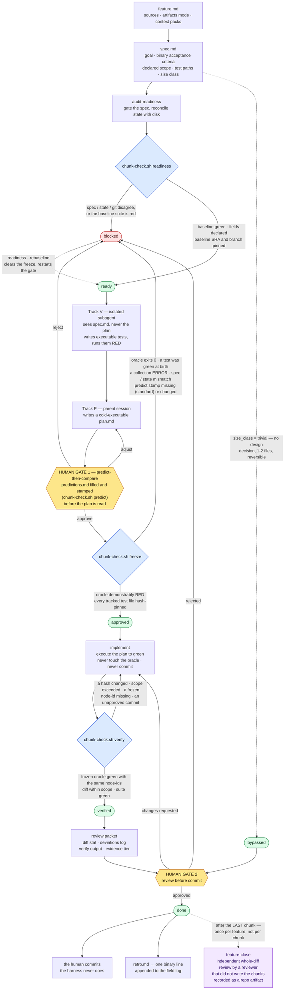
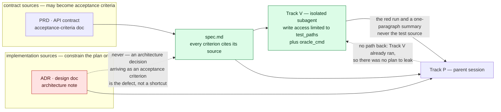

# feature-chunker

[](https://github.com/nick-railsback/feature-chunker/actions/workflows/checks.yml)

**Agile for agents.** A feature becomes documented *chunks*; each chunk moves
through staged, resumable checkpoints where every transition is made by a script
rather than by an agent's opinion of its own work.

The premise is narrow and it is the whole design: **an agent's claim that
something works is not evidence that it works.** So the lifecycle contains no
stage an agent can enter by attesting. The oracle is executable test code,
written before the plan exists, demonstrated failing before implementation
exists, hash-pinned at approval, and re-run at the end. What passes the gate is
what the runner says, not what the transcript says.

🧰 **Install from a clone** — `SKILL.md`, `references/`, `bin/`, `templates/`
copy into `~/.claude/skills/`; this repository is the canonical source. See
[Install](#install).

---

## Contents

- [The problem](#the-problem)
- [The lifecycle](#the-lifecycle)
- [The seven non-negotiables](#the-seven-non-negotiables)
- [Where the guarantees actually live](#where-the-guarantees-actually-live)
- [The oracle is written blind](#the-oracle-is-written-blind)
- [The agentic practices it applies](#the-agentic-practices-it-applies)
- [The eval practices it applies](#the-eval-practices-it-applies)
- [What makes this different](#what-makes-this-different-from-a-spec-driven-framework)
- [Install](#install)
- [Using it](#using-it)
- [Repository layout](#repository-layout)
- [Known limits](#known-limits)
- [Design notes](#design-notes)

---

## The problem

Agent-assisted feature work fails in a small number of recognizable ways, and
none of them are fixed by a better prompt:

| Failure | What it looks like |
|---|---|
| **Attestation as evidence** | "Implemented and tested" in the transcript; the feature does not work. |
| **The tuned oracle** | Tests written after — or from — the implementation plan. They confirm the design, including the parts that are wrong. |
| **The reward hack** | A test weakened to pass. The check is satisfied; the user is not. |
| **Silent scope creep** | "It was easier to also change X" turns a reviewable diff into an unreviewable one. |
| **Cold-session amnesia** | One logical task spread over three sessions, each re-deriving what the last one knew. |
| **Review deleted by automation** | The agent commits before a human reads the diff, so the outer gate never existed. |

feature-chunker answers each of these with a mechanism, not a reminder. The
mechanisms are `bash` + `git` + `jq` in one script, a `PreToolUse` hook, and two
human gates placed where human judgment is actually cheaper than machine
judgment.

---

## The lifecycle

```
specified → ready → approved → verified → done
            (audit-readiness) (plan gate)  (audit-implementation → human review)
```

There is deliberately **no `implemented` stage**. The only honest transition out
of implementation is the one `verify` makes, because that is the one backed by a
check — a stage whose sole content is an agent attesting to its own work is
exactly what this skill exists to refuse.



**Reading the diagram:** blue diamonds are executed code — the only things that
move a stage. Amber is a human gate. Green is a recorded state in `state.json`.
Every condition on an edge leaving a blue diamond is a literal pass or refusal in
`bin/chunk-check.sh`, not a description of intent. The purple tail is the one
once-per-feature stage: `feature-close` runs after the last chunk's `done`, and
its record is a repo artifact rather than a `state.json` field.

Four operations correspond to the four phases, and an agent loads **only the one
in play**:

| Operation | When | What it does |
|---|---|---|
| `audit-readiness` | Before planning | Reconcile recorded state against disk, gate the spec's quality, rerun the baseline suite, pin the baseline SHA. |
| `plan` | Stage is `ready` | Track V writes the red oracle in isolation; Track P writes a cold-executable plan; the human plan gate runs; the oracle is frozen. |
| `implement` | Stage is `approved` | Execute the plan to green without touching the oracle and without committing. |
| `audit-implementation` | Implementation done | Deterministic verify, assemble the review packet, run the human gate, write the retro. |

One more stage runs once per **feature** rather than once per chunk:
`feature-close` (`references/feature-close.md`). After the last chunk is done
and before release, the cumulative diff gets an independent review by a
reviewer that did not write the chunks — because per-chunk gates structurally
cannot see the seams between chunks, and a same-author oracle plus a
same-thread human review cannot have uncorrelated blind spots with the
implementation. The first full feature proved the gap: ten defects shipped
through 24 approved chunks and an independent whole-diff review found them in
minutes. The review is recorded as a repo artifact, and its findings feed a
findings-remediation workflow.

---

## The seven non-negotiables

1. **The oracle is executable and written blind.** Validation is real test code
   derived from `spec.md` only, demonstrated **red** before implementation
   exists. A prose "validation plan" is not an oracle.
2. **The oracle is frozen.** Test files are hash-pinned at plan approval and
   never touched during implement. A wrong test is a stop-and-surface back to
   the plan gate, not an edit.
3. **Verify, don't trust.** Session pickup re-derives state from disk and reruns
   checks. Recorded green is a claim, not a fact.
4. **Plans are cold-executable.** If an agent that has read nothing else can't
   execute the plan, the chunk is too big — split it.
5. **Scope is declared, then enforced.** The diff must stay inside the declared
   paths. Expansion is a stop-and-surface, not a judgment call.
6. **Two human gates, both instrumented.** Predict-then-compare on the plan —
   blind on `standard` chunks, where `chunk-check.sh predict` stamps the
   predictions before the plan is read; `small` chunks gate on read-and-verdict
   alone (softened 2026-07-31). Review-before-commit on the diff. Gates earn
   their keep via the field log or get demoted — by data, not by mood.
7. **Ceremony must be proportionate.** Trivial work bypasses the lifecycle. The
   `bypass` op requires `size_class` to be exactly `trivial` and refuses from any
   stage past `ready`, so the escape hatch cannot quietly become "skip the
   ceremony, I'm in a hurry." Correcting an over-escalation spotted later is the
   one exception, and it is explicit rather than quiet: `--downgrade` is legal
   from any stage before `done` — except on a chunk already bypassed, or one
   already trivial, where there is no over-escalation left to correct — and it
   records that the correction happened.

---

## Where the guarantees actually live

`bin/chunk-check.sh` — `bash` + `git` + `jq`, no other dependencies. Guarantees
live here as executed code at roughly zero attention cost, not as prose asking
an agent to be careful.

| Op | Refuses to proceed unless… |
|---|---|
| `readiness` | recorded state reconciles with disk **in both directions**, every declared field is legal, no `## Out of scope` exclusion asserts something about existing behaviour uncited, and the baseline suite is green |
| `predict` | `predictions.md`'s top half is filled while its verdict is still blank — a file filled in one pass records a gate outcome about a plan that did not yet exist, and is refused |
| `freeze` | the plan gate ran and returned `approve`, all four spec blocks agree with state, and `oracle_cmd` **executes red** with nothing green at birth and no collection `ERROR` |
| `verify` | the frozen test-hash map still matches exactly — no pinned file modified, and none added or removed under `test_paths` — the frozen `oracle_cmd` — **the same string** — now exits zero with no `FAILED` or `ERROR` of its own and every red node-id reported `PASSED`, the diff stays inside declared scope, and the suite is green. A commit before the review gate is *recorded* as `gates.review=premature`, not refused; `gate approved` is where it must be answered for |
| `log` | the retro's field-log line is really on disk, carries the `gate:` verdict the state actually recorded, and leaves no field unanswered |
| `gate <verdict>` | the stage is `verified` or `bypassed` — it cannot be used to skip the verification it is supposed to follow — and `approved` additionally requires the field-log entry, plus a note acknowledging the early commit whenever `gates.review` is `premature` |
| `bypass` | `size_class` is exactly `trivial` and the stage is at most `ready` — or, with `--downgrade`, any stage before `done` other than a chunk already bypassed or already trivial, which corrects an over-escalation and records that it happened |
| `block` / `status` | — (record a blocker with a required reason; print state) |

**Each op's full contract — every clause, and the incident that earned it — is
in [SKILL.md § The deterministic backstop](SKILL.md#the-deterministic-backstop).**
The table above summarises deliberately rather than restating: the restatement
is what drifted, twice in two days, and a summary that links cannot fall out of
step with what it summarises.

Three of those deserve to be called out, because they are the ones that close
loopholes rather than check boxes:

- **A green oracle fails the freeze.** A test suite that passes before the
  feature exists cannot demonstrate the feature's absence, so it cannot
  demonstrate its presence either. `freeze` executes the command and requires a
  non-zero exit; a test that passed at birth fails the freeze *by name*, and a
  collection `ERROR` — red for the wrong reason — fails it too.
- **A narrowed command cannot buy a green.** `verify` re-runs the exact string
  pinned at freeze and requires each previously-red node-id to appear as
  `PASSED`. A skip, a rename, or a test that stopped being collected fails here.
- **The harness never commits, and the rule is enforced twice.** An optional
  `PreToolUse` hook — user-level configuration, not repository content; see
  [Install](#install) — *prevents* the tool call while any chunk sits at
  `ready`/`approved`/`verified` without an approved review gate, including
  through `sh -c` payloads and wrapper words like `env`.
  `verify` independently *detects* commits made since baseline and hard-fails.
  Neither reaches the human's own terminal, which is correct: the human
  committing is the design's intended exit, not the threat.

### The backstop has its own oracle

`bin/test-chunk-check.sh` builds throwaway git repositories in `$TMPDIR` and
asserts each guarantee end to end — including a full lifecycle run to `done`
with the chunks directory untracked. It is held to non-negotiable #1: after
adding a check, you delete that check in a scratch copy and confirm the suite
goes **red**, because green only ever means "no fixture noticed."

That discipline is not decorative. A mutation trial in July 2026 deleted eight
checks one at a time and found **five that the suite did not catch**, including
both halves of non-negotiable #1. The failure is recorded in the suite's header
and the missing cases were written. Finding and publishing your own suite's
blind spots is the difference between "I built a process" and "I built a process
and then tried to break it."

```zsh
bash bin/test-chunk-check.sh      # the harness's oracle
```

---

## The oracle is written blind

The single most load-bearing structural decision: **the validation must not see
the plan.** Writing the oracle after — or from — the implementation design is
tuning the check on the answer key. So Track V runs *first*, in a subagent, and
there is no plan yet for it to see. That is a physical split, not a convention.



The same classification governs every stage, because a guarantee enforced by
isolation is only ever as good as the artifacts allowed to cross it:

| Stage | `contract` context | `implementation` context |
|---|---|---|
| `audit-readiness` — *writes* `spec.md` | load | **never** |
| `plan` → Track V — writes the oracle | load | **never** |
| `plan` → Track P — writes the plan | load | load |

`audit-readiness` inherits Track V's restriction not because it is early, but
because it writes the document Track V reads. Architecture in the window while
acceptance criteria are being written becomes architecture *in* the criteria —
and the subagent boundary cannot catch what the spec already carries. The test
for an unclassified document: **if this system were rewritten from scratch a
different way, would this still be true?** Yes → contract. No → implementation.

The converse guarantee — that the plan must not see the validation — is
deliberately **not** claimed, because it isn't true: Track P is written by the
parent, which has read Track V's summary. That is the lesser risk by a wide
margin. A plan shaped to satisfy the tests is a plan doing its job; a test
shaped to confirm the plan is a contaminated oracle. Stating half a guarantee
accurately beats stating a symmetric one that only holds in one direction.

---

## The agentic practices it applies

Every primitive here was chosen against an explicit axis, not a feature list.

| Practice | How it shows up |
|---|---|
| **Advisory vs. mandatory, split cleanly** | Prompted behavior is probabilistic; hooked behavior is deterministic. Every *rule* lives in `chunk-check.sh` or the `PreToolUse` hook. The reference files carry the *teaching* half — the reasoning a human needs to disagree intelligently. Nothing important is a `NEVER` in prose. |
| **Progressive disclosure, priced** | The always-on cost of this skill is one `description` block — under 200 tokens, paid on every turn of every session whether it fires or not. The routing table then loads exactly one reference per stage: `implement` pulls in 76 lines, not the ~800 lines of reference material the skill contains. |
| **Standing cost separated from operational cost** | `references/setup.md` exists specifically to hold once-per-machine material that used to sit on the routing surface, where it was paid for on every trigger and read on almost none of them. |
| **Subagents for isolation, not just for tokens** | Track V is a subagent because a fresh context *cannot* see the plan — the isolation buys a correctness guarantee. Exploration during planning uses read-only subagents (`Read`/`Glob`/`Grep`, no write, no shell); findings land in `plan.md`, and the exploration texture dies there by design. |
| **State in files, so session boundaries are free** | `state.json` holds stage, SHAs, branch, artifacts mode, oracle hashes and red evidence — all script-managed. Pickup re-derives from disk and re-runs checks. Nothing asks the model not to stop; stopping is simply cheap. |
| **Context loaded by pointer, never inlined** | A named context pack loads on demand and costs nothing until it matches. A pack pasted into a spec is paid for on every read of that spec forever — and stale context is *trusted*, so it is worse than missing. |
| **Scope chosen deliberately** | User-level install is the default because the evidence base spans projects. The team variant — project-level skill, repo-local field log — is documented as a fork with named costs, not offered as a neutral toggle. |
| **The escape hatch is enforced too** | Proportionality is non-negotiable #7, but "trivial" is a machine-checked value and `bypass` is illegal past `ready`. An escape hatch nobody can widen is the only kind that survives contact with a deadline. |

## The eval practices it applies

The lifecycle is, structurally, an eval harness for feature work.

| Practice | How it shows up |
|---|---|
| **Cheapest rung that catches the failure** | Code check → hybrid → LLM judge → human review. Acceptance criteria must be binary and mechanically checkable; a criterion you can't imagine a test asserting is not a criterion yet. Every vague criterion waved through becomes an expensive, unvalidated judged check downstream. |
| **An oracle you never saw fail is unvalidated** | `freeze` executes the oracle and requires it to fail. Green-at-birth tests and collection errors are refused *by name*. This is the eval discipline of proving your grader detects absence, applied to a test suite. |
| **Never tune against what you report** | Track V's isolation is the physical train/test split: the thing being graded cannot influence the grader, because the grader was written first, in a context that could not see it. |
| **Behavior, not just outcome** | `verify` does not accept "the suite is green." It requires the same pinned command, the same node-ids passing, an unchanged hash map, and a diff inside declared scope. The endpoint can pass while the trajectory quietly deleted something. |
| **A metric that hides its own weakness stops measuring** | `verify` records an evidence tier — `node-ids`, `exit-code`, or `legacy` — and `audit-implementation` requires the review packet to **disclose** a weak tier. The number arrives with what it can't support attached. |
| **Binary named observations, never Likert soup** | The retro is yes/no and boring on purpose: did the plan gate change the plan, did the oracle catch a real defect (and in how many red→green iterations), was a scope deviation surfaced, was the ceremony proportionate. Nobody can act on a 4.6/7 "how did it go." |
| **Incident → case → fix** | Any observed process failure becomes a concrete change to these reference files **in the session that earned it**, not deferred to a hypothetical cleanup pass. The mutation trial above is the same rule applied to the harness's own suite. |
| **Gate the deterministic, report the noisy** | A branch mismatch *warns*, because a deliberate rename is legitimate and the op you'd run to recover is the one that would block. A scope or hash mismatch *fails*. Blocking on noise trains people to bypass the gate. |
| **Same-model review is not independence** | `audit-implementation` states plainly that it is **not** an independent review: running it in a fresh subagent buys immunity to context poisoning and to the commitment pressure of having just written the code, but it does not buy uncorrelated blind spots, because it is the same model reading the same artifacts. The independence in this design comes from the script and from the human. |
| **A gate must earn its keep with data** | The plan gate defaults on and only *data* retires it. The demotion rule lives in the field log's header — the single authoritative copy — and requires a run of consecutive clean gates before the gate can be demoted. A gate nobody acts on is theater, but you prove that with evidence, not impatience. |

---

## What makes this different from a spec-driven framework

The popular spec-driven agent frameworks and this skill agree on the diagnosis:
unstructured agent work on a large feature goes badly, and the fix is documented
artifacts with staged handoffs. They disagree about what a *handoff* is.

| | The common shape | feature-chunker |
|---|---|---|
| **Definition of Done** | A checklist an agent ticks. Test output is frequently an *optional* input to the check. | A script that re-runs the pinned oracle and refuses to stamp the stage otherwise. |
| **Validation** | A prose "validation plan," later judged by the same model that wrote it. | Executable test code, demonstrated red before implementation exists. The runner is the validator. |
| **Independence** | A cast of named agent personas — architect, dev, reviewer, arbiter — reviewing one another. | Zero personas. Two scoped, ephemeral subagent roles, chosen for *information isolation* rather than for character, plus a script that does not care who is asking. |
| **Session model** | Prose instructing the model not to stop at "milestones" or "session boundaries." | Session boundaries assumed and made cheap. State on disk; pickup re-derives and re-runs. |
| **Handoff between stages** | A document plus a checklist. | A document plus a hash-pinned oracle, a pinned baseline SHA, and a script that refuses the next stage. |
| **Commit discipline** | The agent commits when it believes it is done. | The harness never commits. A hook prevents it; `verify` detects it; the human's own terminal is untouched. |
| **Scope control** | "Stay focused on the story" in prose. | Every changed path since a pinned SHA must fall inside the declared scope, checked mechanically — untracked files included, and a sibling chunk's directory is not exempt, because that is another review's diff. |
| **Standing context cost** | Dozens of skill descriptions resident in the system prompt on every turn, including turns with nothing to do with feature work. | One description. Under 200 tokens. |
| **Surface to learn** | Agents, workflows, checklists, step scripts, story files, sprint status, shards. | Four operations, one script, seven non-negotiables. |

Measured on the same machine against one widely-used framework install (numbers
taken, not recalled): **8.8–13.7× less always-on context**, **18–32× fewer
files**, and a development lifecycle containing **zero executable checks** on
their side versus a harness whose every stage transition is executed code on
this one.

Two honest qualifications, because a comparison that only cuts one way isn't a
measurement:

- The per-operation context win is real but smaller than the standing-cost win,
  and it *erodes* across multiple sessions — the routing file gets re-read each
  time, and this skill is the one recommending fresh sessions.
- Framework size is a proxy for adoption cost, not a measurement of it. "18×
  smaller" is a good line; "we onboarded N engineers in M days" is the one that
  closes, and this artifact does not have that number yet.

The deeper difference is philosophical. A framework built out of documents and
checklists is asking the model to be diligent, and it degrades exactly when the
model is under the most pressure to be done. This one assumes the diligence will
fail and puts a program in the path.

---

## Install

**Requirements:** `bash`, `git`, `jq`. The oracle and suite are shell command
strings, so the target project can be in any language with any test runner.

Designed for [Claude Code](https://docs.claude.com/en/docs/claude-code) Agent
Skills. The harness itself is a standalone script — nothing in
`bin/chunk-check.sh` knows what agent is calling it.

### 1. The skill

From a clone of this repository — what installs is `SKILL.md`, `CANDIDATES.md`,
`bin/`, `references/`, `templates/`, and nothing else:

```zsh
rm -rf ~/.claude/skills/feature-chunker
mkdir -p ~/.claude/skills/feature-chunker
git ls-files -z --error-unmatch SKILL.md CANDIDATES.md bin references templates \
  | rsync -a --files-from=- --from0 . ~/.claude/skills/feature-chunker/
```

**It names what ships rather than excluding what does not**, and that is the
point: an exclude list is a denylist, so anything later added to the repo root
installs by default and the sentence above stops being true without anyone
editing it. That is not hypothetical — the exclude form this replaced shipped a
`.claude/` directory and a stray `docs/` tree while still claiming "nothing
else". `bin/test-docs.sh` extracts this exact block, runs it, and compares the
result against that sentence, so the claim and the command cannot drift apart.

**`git ls-files` decides what those names cover**, because naming five paths
still left a denylist one level down: rsync does not read `.gitignore`, so a
`__pycache__` under `references/` or an editor swapfile under `bin/` shipped
into real installs and broke the file count below on any clone that happened to
be dirty. The tracked set is the only definition of "what this repository is"
that cannot silently acquire a member. `--error-unmatch` keeps the wrong-
directory paste loud — it names every path it could not find and exits non-zero,
where a bare copy would quietly install nothing.

**The destination is cleared first**, because an allowlist governs only what
rsync sends and says nothing about what is already at the other end. Upgrading
in place left every denylist-era install carrying the `.claude/` and `docs/`
trees this section says are not there, and `--delete` does not reach them: it
prunes the directories rsync transfers, and the destination root is not one of
them. Nothing user-owned lives under that path — the field log sits at
`~/.claude/feature-chunker-field-log.md`, deliberately outside the skill
directory — so clearing and recopying is the whole upgrade. `bin/test-docs.sh`
runs the block a second time over a seeded stale install and requires the
result to equal a first-time install's.

**`CANDIDATES.md` ships**, and is the one non-obvious member of that list. It is
not repo-only bookkeeping: `chunk-check.sh` resolves it relative to the
installed script, and `log` reads it to print the candidate classes that have
reached the escalation threshold. An install without it loses that warning in
silence — `candidates_overdue` treats a missing ledger as "nothing overdue",
which is correct behaviour and indistinguishable from an empty backlog. The
genuinely repo-only files are the ones with no read path from the harness:
`README.md`, `CHANGELOG.md`, `LICENSE`, `.gitignore`.

The repo is canonical and the installed copy is an install, not a fork —
improvements land here, versioned, and re-run the block above in full
(CHANGELOG.md is the record of what changed and why).

**User-level is the default, and the design assumes it.** The field log lives
outside both the skill directory and any repo because the evidence base spans
projects: one installation means one place improvements land and one dataset the
demotion rule can reach its sample size on. A copy per project forks that into N
drifting copies, each with a partial log, none of them accumulating. The
project-level copy is the team case — take it deliberately, and move the field
log into the repo.

### 2. The commit-preventer hook (optional, recommended)

The hook is user-level configuration rather than skill content, and this
repository does not ship one — like `feature-close`'s independent reviewer, it
is a per-install contract. What yours must do: deny a `git commit` tool call
while any chunk in the project sits at `ready`/`approved`/`verified` without an
approved review gate — including commits arriving through `sh -c` payloads and
wrapper words like `env`. `references/setup.md` § The commit-preventer hook
records the bypass shapes a hand probe found, and the tail a static parser
deliberately leaves to `verify`.

Register it as a `PreToolUse` hook on `Bash` in `~/.claude/settings.json`:

```json
{
  "hooks": {
    "PreToolUse": [
      {
        "matcher": "Bash",
        "hooks": [
          {
            "type": "command",
            "command": "/usr/bin/env python3 /Users/you/.claude/hooks/chunk-no-commit.py"
          }
        ]
      }
    ]
  }
}
```

Without it, the commit prohibition degrades from *prevent* to *detect*: `verify`
still hard-fails on commits the review gate has not approved, but only when
someone runs `verify`.

### 3. Verify the install

```zsh
cd ~/.claude/skills/feature-chunker
bash bin/test-chunk-check.sh
```

The suite builds throwaway git repositories in `$TMPDIR`; it touches nothing you
own.

---

## Using it

Invoke it as `/feature-chunker`, or just describe the work — the skill triggers
on breaking a feature into chunks, asking whether a chunk is ready to plan,
planning or implementing a chunk, or picking up documented feature work in a
fresh session.

### Once per feature

The skill asks three questions and records every answer **in files** — an answer
that lives in chat scrollback doesn't exist next session:

1. **What is this feature derived from?** Each source is classified `contract`
   (may produce acceptance criteria) or `implementation` (constrains the plan,
   never the spec). Every acceptance criterion then cites its source, which is
   what makes a human's extraction checkable instead of an act of faith.
2. **Are the chunk docs committed?** `tracked` for a team, where the specs are
   the shared artifact; `untracked` for personal projects, where committing every
   spec accumulates a directory of near-identical documents describing code that
   no longer exists. Both costs are stated out loud before you choose, and
   `readiness` reconciles the answer against git in both directions.
3. **What context should an agent load before planning here?** Context packs, as
   pointers and never inlined, under the same classification.

### Then, per chunk

```zsh
# run from the root of the target repo
CHUNK=docs/chunks/checkout/03-idempotent-retry
SKILL=~/.claude/skills/feature-chunker

# 1. Is this chunk fit to plan? Reconciles state with disk, gates the spec,
#    reruns the baseline suite, pins the baseline SHA.  →  stage: ready
bash $SKILL/bin/chunk-check.sh readiness $CHUNK

# 2. Plan. Track V writes the red oracle in a subagent that has never seen a
#    plan; Track P writes the cold-executable plan. Fill in predictions.md's
#    top half BEFORE reading plan.md, and stamp it while the verdict is
#    still blank — this is what makes "the predictions were blind" checkable:
bash $SKILL/bin/chunk-check.sh predict $CHUNK
#    Then read the plan and the red tests, record the verdict, and on
#    approve:                                           →  stage: approved
bash $SKILL/bin/chunk-check.sh freeze $CHUNK

# 3. Implement to green. Never touch a file under test_paths. Never commit.

# 4. Verify: oracle unchanged, frozen red node-ids now passing, diff inside
#    scope, suite green, no unapproved commits.          →  stage: verified
bash $SKILL/bin/chunk-check.sh verify $CHUNK

# 5. Append the chunk's line to the field log (Write/Edit, never a shell >>),
#    with closed:pending — feature-close resolves it later. This prints the
#    computed demotion streak and any overdue candidate in CANDIDATES.md:
bash $SKILL/bin/chunk-check.sh log $CHUNK

# 6. Read the diff with the review packet beside it, then record the verdict.
#    approved → done  |  changes-requested → back to implement  |  rejected → blocked
#    On the last chunk this also names the feature-close the feature now owes.
bash $SKILL/bin/chunk-check.sh gate $CHUNK approved

# 7. You commit. The harness never does.
```

Anywhere along the way:

```zsh
bash $SKILL/bin/chunk-check.sh status $CHUNK            # print the chunk's state
bash $SKILL/bin/chunk-check.sh block  $CHUNK "reason"   # stop-and-surface
bash $SKILL/bin/chunk-check.sh bypass $CHUNK "what"     # trivial work, no ceremony
bash $SKILL/bin/chunk-check.sh readiness $CHUNK --rebaseline  # clears the freeze
```

`readiness` on an in-flight chunk is safe: above stage `ready` it becomes
reconcile-only and writes nothing, so it cannot move a baseline out from under a
live freeze. Re-pinning above `ready` requires `--rebaseline`, which clears the
freeze and sends the chunk back through the plan gate — because moving the clock
means restarting the chunk, not keeping its approval.

### State in the target repo

Every chunk is a directory under `docs/chunks/<feature>/` holding its spec,
plan, predictions and retro alongside a script-managed `state.json` and the two
captured oracle runs. **The tree is drawn in
[SKILL.md § State layout](SKILL.md#state-layout-in-the-target-repo)** — once,
because it used to be drawn twice and the copies were what drifted.

What matters here rather than there: the tree lives **in the repo working
directory** whether or not it is committed, never outside it. `chunk-check.sh`
refuses a chunk directory outside the repo root, and an agent's write sandbox is
typically the working directory, so state written under `~/` gets denied — and a
denied write that looks like it worked is how state silently stops being kept.

---

## Repository layout

```
SKILL.md                        # the routing surface — the only always-on cost
references/
  audit-readiness.md            # gate the spec, reconcile state, feature setup
  plan.md                       # two tracks, context classification, the plan gate
  implement.md                  # execute to green; the rules and the failure modes
  audit-implementation.md       # verify, review packet, the retro
  feature-close.md              # once per feature: independent whole-diff review
  setup.md                      # install, the hook, the field log, full CLI surface
bin/
  chunk-check.sh                # the deterministic backstop — every guarantee
  test-chunk-check.sh           # the backstop's own oracle
  test-docs.sh                  # the prose surfaces' oracle: the install
                                #   command, and the contracts stated twice
templates/
  feature.md  spec.md  plan.md  predictions.md  retro.md  state.json  field-log.md
CHANGELOG.md                    # every earned change, cited to its incident
CANDIDATES.md                   # maintainer-sized proposals, with the
                                #   second-occurrence escalation rule —
                                #   read by `log`, which warns while any
                                #   entry is open at two or more sightings
```

The part that installs into `~/.claude/skills/` is 18 files, ~371 KB — the count
exactly and the size to ±10 KB, checked on every push by `bin/test-docs.sh`,
which runs the install command above and weighs the result. It checks this
sentence rather than rewriting it: the figure is still typed by hand, and what
changed is that a wrong one now reddens CI instead of sitting here. The previous
figure sat stale by more than 2× for as long as nobody checked it, in a document
that stakes its comparison table on numbers taken rather than recalled. None of it is
a runtime cost until it fires: Claude Code loads only `SKILL.md`'s frontmatter —
this README, the reference bodies, and the templates are read on demand or not
at all.

---

## Known limits

Published rather than papered over, because the whole argument is evidence over
assertion and that has to apply to the artifact itself.

- **Nothing checks that every acceptance criterion became a test.** `freeze`
  proves the oracle runs red, is calibrated, and is pinned. It does not prove
  coverage. A Track V that translates three of five criteria into tests freezes
  cleanly, verifies green, and reaches `done` with 40% of the feature
  unvalidated. The only thing standing in the way is the human reading the diff —
  a real gate, but a *judged* one, and judged gates are what this design falls
  back to rather than relies on. The fix is cheap and mechanical: number the
  criteria, require Track V to tag each test with the criterion it implements,
  and have `freeze` assert a set difference of zero.
- **Track V's isolation is procedural, not mechanical.** Sequencing makes
  contamination impossible *if* the agent actually dispatches Track V first, in a
  subagent, before writing Track P. Nothing in `chunk-check.sh` verifies that it
  did. The red-oracle requirement catches the worst downstream symptom — a test
  tuned to pass — but not the cause.
- **`suite_cmd` and `oracle_cmd` are shell strings executed with `bash -c`.**
  Named rather than mitigated, on purpose: sandboxing or allowlisting a
  test-runner command line would break every legitimate use (`poetry run pytest
  …`, `npm test --`, compound commands) to defend against a threat model —
  running someone else's chunk directory — that this skill's user does not have.
  On a cloned or agent-authored chunk directory, read both values before running
  any op.
- **`audit-implementation` is not an independent review.** It says so itself. See
  the eval-practices table above.
- **Single-repo by construction** — one `git rev-parse --show-toplevel`, one
  chunk tree. Cross-repo work means one feature directory per repo, each
  `feature.md` naming its siblings.
- **The evidence base is young.** The demotion rule that retires an unproductive
  gate needs a run of logged chunks before it can fire. Until then, the
  proportionality claims in this design are unfalsified rather than validated.

---

## Design notes

Two decisions that are easy to miss and load-bearing:

**The bypass exists because a harness that costs more than the work teaches its
user to stop using it.** Full ceremony on a two-minute change is how process
dies. So `trivial` work skips the lifecycle — and still exits through the human
review gate, and still gets a field-log line, because bypassed chunks are the
*only* evidence that the ceremony was ever disproportionate. They are invisible
to a dataset made only of chunks that paid for it.

**The retro is how the skill improves.** Observed process failures become changes
to these reference files in the session that earned them — incident, case, fix.
The skill gets better the same way it asks code to.


